# 🔧 ระบบแจ้งซ่อมภายในโรงเรียน (School Repair Request System)

[](https://www.python.org/)
[](https://flask.palletsprojects.com/)
[](https://www.sqlite.org/)
[](https://getbootstrap.com/)
[](test_system.py)
[](LICENSE)

**โครงงานตามใบงานปฏิบัติการ: การวิเคราะห์ออกแบบระบบ (OOAD) และการพัฒนาเว็บแอปพลิเคชันด้วย Python**  
*Python 3.10+ | SQLite | Flask | Bootstrap 5 | SweetAlert2*

---

## 📖 ภาพรวมระบบ (System Overview)

ระบบแจ้งซ่อมภายในโรงเรียน พัฒนาขึ้นเพื่อแก้ไขปัญหาการติดตามงานซ่อมอุปกรณ์ อาคาร สถานที่ ครุภัณฑ์ คอมพิวเตอร์ และระบบสาธารณูปโภคต่างๆ ในโรงเรียน โดยรวบรวมงานซ่อมไว้ในจุดเดียวตั้งแต่:
1. **การรับแจ้งปัญหา** จากครูและบุคลากร พร้อมแนบรูปภาพก่อนซ่อม (Before Images) และ Live Preview
2. **การคัดกรองและมอบหมายงาน** กำหนดวันแล้วเสร็จ (Due Date) โดยหัวหน้างาน/ผู้ดูแลระบบ (Admin)
3. **การเริ่มปฏิบัติงานและบันทึกผล** บันทึกค่าใช้จ่าย พร้อมแนบรูปภาพหลังซ่อม (After Images) โดยช่าง (Technician)
4. **การสรุปผลสถิติบน Dashboard** แสดงสถานะงาน การส่งออกข้อมูลเป็น CSV (UTF-8 BOM สำหรับ Excel) และพิมพ์ใบงานมาตรฐาน (Printable A4 / PDF)

---

## 🔄 วงจรการดำเนินงาน (Workflow Diagram)

```mermaid
flowchart LR
    A["📝 ครู/บุคลากร แจ้งซ่อม<br/><b>รอรับเรื่อง (Pending)</b>"] -->|"👑 Admin มอบหมายช่าง & กำหนดเสร็จ"| B["📋 ได้รับมอบหมายแล้ว<br/><b>รับเรื่องแล้ว (Accepted)</b>"]
    B -->|"🔧 ช่างกดเริ่มปฏิบัติงาน"| C["⚙️ กำลังซ่อมบำรุง<br/><b>กำลังดำเนินการ (In Progress)</b>"]
    C -->|"✅ บันทึกผล, ค่าใช้จ่าย & รูปหลังซ่อม"| D["🎉 ปิดงานซ่อม<br/><b>ซ่อมเสร็จสิ้น (Completed)</b>"]
    
    style A fill:#e2e8f0,stroke:#64748b,stroke-width:2px,color:#0f172a
    style B fill:#bae6fd,stroke:#0284c7,stroke-width:2px,color:#0c4a6e
    style C fill:#fef08a,stroke:#ca8a04,stroke-width:2px,color:#713f12
    style D fill:#bbf7d0,stroke:#16a34a,stroke-width:2px,color:#14532d
```



---

## ✨ ฟังก์ชันหลักของระบบ (Key Features)

- 🔐 **ระบบจัดการผู้ใช้และสิทธิ์การเข้าถึง (Role-Based Access Control):**
  - **Admin (ผู้ดูแลระบบ):** ตรวจสอบงานทั้งหมด, มอบหมายงานให้ช่าง, เพิ่ม/แก้ไข/ลบผู้ใช้, ดูสถิติรวม
  - **Teacher (ครู/บุคลากร):** แจ้งซ่อมใหม่, ติดตามสถานะงานของตนเอง, เขียนความคิดเห็นสอบถาม
  - **Technician (ช่างซ่อม):** ดูงานที่ได้รับมอบหมาย, เริ่มงานซ่อม, บันทึกผลการซ่อม/ค่าใช้จ่าย/รูปหลังซ่อม
- 📝 **แจ้งซ่อมและกำหนดความเร่งด่วน:** ระบุอาคาร, ห้อง, ประเภทปัญหา (แอร์, ไฟฟ้า, คอมพิวเตอร์, ครุภัณฑ์, อื่นๆ), ความเร่งด่วน (ต่ำ, กลาง, สูง)
- 📸 **ระบบอัปโหลดรูปภาพปลอดภัย (Before & After):**
  - รองรับการอัปโหลดหลายรูปภาพพร้อมกัน
  - Live Preview รูปภาพก่อนกดส่งแบบทันที
  - ป้องกันความปลอดภัยด้วย `secure_filename()` และ UUID เพื่อป้องกัน File Collision และ Path Traversal
- 📌 **วงจรชีวิตสถานะงาน (Workflow State Transition):**
  - `รอรับเรื่อง (Pending)` ➔ `รับเรื่องแล้ว (Accepted)` ➔ `กำลังดำเนินการ (In Progress)` ➔ `ซ่อมเสร็จสิ้น (Completed)`
  - มี Guard Condition ป้องกันการข้ามขั้นตอนตามหลัก State Pattern
- 💬 **ระบบความคิดเห็นและประวัติการบันทึก (Comments & Audit Log):**
  - บันทึกการสื่อสารระหว่างผู้แจ้งซ่อม ผู้ดูแล และช่าง
  - มีระบบบันทึก Log อัตโนมัติเมื่อมีการมอบหมาย เริ่มงาน หรือปิดงาน
- 📊 **Dashboard อัจฉริยะและการส่งออกข้อมูล:**
  - การ์ดสรุปสถิติจำนวนงาน 4 สถานะหลัก (คลิกเพื่อกรองข้อมูลได้ทันที)
  - สรุปจำนวนงานแยกตามหมวดหมู่ปัญหา (คลิกเพื่อดูรายการแยกประเภทได้ทันที)
  - ส่งออกข้อมูลเป็นไฟล์ Excel / CSV (พร้อม UTF-8 BOM ภาษาไทยเปิดใน Excel ได้สมบูรณ์)
- 🖨️ **พิมพ์ใบงานมาตรฐาน (Printable A4 / PDF):**
  - ใบแจ้งซ่อมและรายงานผลการปฏิบัติงาน พร้อมช่องลงนาม 3 ฝ่าย (ผู้แจ้ง, ช่าง, ผู้อนุมัติ)
- 🔔 **SweetAlert2 Notifications:** แจ้งเตือนแบบ Toast และ Confirmation Dialog ป้องกันการลบข้อมูลโดยไม่ตั้งใจ
- 🛡️ **Custom Error Pages:** มีหน้าแจ้งเตือน 404 (Not Found) และ 500 (Server Error) สวยงามเป็นมิตร

---

## 📂 โครงสร้างโปรเจกต์ (Project Structure)

```
School-Repair-Request-System/
├── app.py                     # Main Flask Application, Routes & Error Handlers
├── config.py                  # ค่ากำหนดของระบบ (Database URI, Upload Path, Secret Key)
├── database.py                # อินสแตนซ์ SQLAlchemy db
├── models.py                  # Domain Dataclass, Enums, และ SQLAlchemy ORM Models
├── helpers.py                 # ยูทิลิตี (สร้างรหัสอัตโนมัติ, อัปโหลดไฟล์, ตรวจสอบสิทธิ์, วันที่ไทย)
├── seed.py                    # สคริปต์สร้างฐานข้อมูลและเพิ่มข้อมูลทดสอบพร้อมรูปภาพ (--reset ได้)
├── schema.sql                 # ไฟล์ SQL DDL สำหรับ SQLite (CHECK constraints, Foreign Keys)
├── test_system.py             # ชุดทดสอบ Automated Test Suite (Unit & Integration Tests)
├── requirements.txt           # รายการไลบรารี Python ที่ต้องติดตั้ง
├── LAB_ANSWERS.md             # เฉลยและแนวทางการตอบคำถามในใบงานปฏิบัติการครบทุกข้อ
├── README.md                  # เอกสารแนะนำและคู่มือการใช้งานระบบ
├── .gitignore                 # กำหนดไฟล์ที่ไม่ต้องติดตามใน Git
├── static/
│   ├── css/
│   │   └── style.css          # CSS ปรับแต่ง UI, Stepper และ Print Styling
│   ├── js/
│   │   └── main.js           # SweetAlert2 Helpers, ยืนยันการลบ, Preview รูปภาพ
│   └── uploads/
│       └── repairs/           # โฟลเดอร์เก็บไฟล์ภาพก่อน-หลังซ่อม
└── templates/
    ├── base.html              # Base layout พร้อม Responsive Navbar, Favicon และ SweetAlert2
    ├── login.html             # หน้าล็อกอิน พร้อมปุ่ม Quick Fill บัญชีทดสอบ
    ├── dashboard.html         # แดชบอร์ดสรุปสถิติและงานที่รับผิดชอบ
    ├── repair_list.html       # ตารางรายการแจ้งซ่อม ค้นหา กรอง และส่งออก CSV
    ├── repair_create.html     # แบบฟอร์มแจ้งซ่อมใหม่พร้อมแนบรูปภาพ
    ├── repair_detail.html     # หน้ารายละเอียดงาน สเต็ปงาน มอบหมายงาน บันทึกผล และคอมเมนต์
    ├── repair_print.html      # หน้าพิมพ์ใบงานทางการขนาด A4
    ├── admin_users.html       # หน้าจัดการผู้ใช้ในระบบ (เพิ่ม, แก้ไข, ลบ)
    └── error.html             # หน้าแสดงข้อผิดพลาด (404 / 500)
```

---

## 🛠️ วิธีการติดตั้งและรันโปรเจกต์ (Installation & Running)

### 1. โคลนคลังโค้ด (Clone Repository)
```bash
git clone https://github.com/Kitikon15/School-Repair-Request-System.git
cd School-Repair-Request-System
```

### 2. ตรวจสอบเวอร์ชัน Python
ระบบนี้พัฒนาสำหรับ **Python 3.10+** (ทดสอบสมบูรณ์บน Python 3.10, 3.11, 3.12, 3.14)
```bash
python --version
```

### 3. สร้าง Virtual Environment และติดตั้ง Dependencies
```bash
# บน Windows
python -m venv venv
venv\Scripts\activate

# บน macOS / Linux
python3 -m venv venv
source venv/bin/activate

# ติดตั้งไลบรารี
pip install -r requirements.txt
```

### 4. เตรียมฐานข้อมูลและสร้างข้อมูลตัวอย่าง (Database Seeding)
รันคำสั่งเพื่อสร้างตารางและสร้างข้อมูลตัวอย่าง (ผู้ใช้, ใบแจ้งซ่อม, ความคิดเห็น, และรูปภาพตัวอย่าง):
```bash
python seed.py
```
*(หากต้องการล้างข้อมูลเดิมและสร้างใหม่ทั้งหมด ให้ใช้คำสั่ง `python seed.py --reset`)*

### 5. เริ่มต้นรันเซิร์ฟเวอร์ (Run Flask Server)
```bash
python app.py
```
เปิดเว็บบราวเซอร์ไปที่: **http://127.0.0.1:5000**

---

## 👥 บัญชีผู้ใช้สำหรับทดสอบ (Demo Accounts)

ระบบมีปุ่ม **Quick Fill** ที่หน้า Login เพื่อความสะดวกในการตรวจงาน:

| บทบาท (Role) | Username | Password | ชื่อ-นามสกุล / หน้าที่ |
| :--- | :--- | :--- | :--- |
| 👑 **Admin** | `admin` | `admin123` | ดร.สมชาย บริหารงาน (หัวหน้าฝ่ายบริหารทั่วไป) |
| 🧑‍🏫 **Teacher 1** | `teacher1` | `teacher123` | อาจารย์กานดา สอนดี (กลุ่มสาระวิทยาศาสตร์) |
| 🧑‍🏫 **Teacher 2** | `teacher2` | `teacher123` | อาจารย์ประสิทธิ์ รักเรียน (กลุ่มสาระคอมพิวเตอร์) |
| 🔧 **Technician 1** | `tech1` | `tech123` | นายช่างวิชัย ชำนาญการ (ช่างไฟฟ้า/แอร์) |
| 🔧 **Technician 2** | `tech2` | `tech123` | นายช่างสมปอง มือทอง (ช่างครุภัณฑ์/คอมพิวเตอร์) |

---

## 🧪 การรันชุดทดสอบ (Automated Unit Tests)

ระบบมีชุดทดสอบ `test_system.py` ครอบคลุม:
- การทำงานของ Domain Model (OOP) และ State Transition
- การป้องกันการเปลี่ยนสถานะผิดกฎ (Invalid State Transition Guard)
- ฟังก์ชันสร้างรหัสใบแจ้งซ่อมอัตโนมัติ (`RP-YYYYMM-XXX`)
- การตรวจสอบสิทธิ์การล็อกอินและหน้า Dashboard
- การสร้างใบแจ้งซ่อมและการส่งออกข้อมูลเป็น CSV

รันชุดทดสอบด้วยคำสั่ง:
```bash
python test_system.py
```
*ผลลัพธ์:*
```text
.....
----------------------------------------------------------------------
Ran 5 tests in 3.820s

OK
```

---

## 📄 License
This project is licensed under the MIT License - see the LICENSE file for details.
